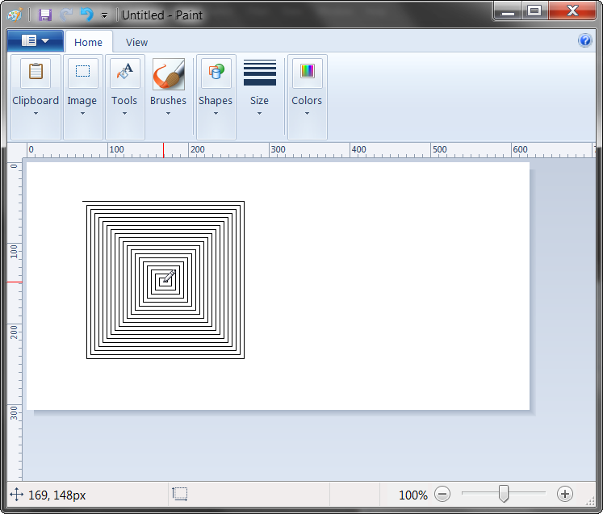

# PyAutoGui Spiral Drawer

This script drags the mouse in a square spiral shape in MS Paint (or any graphics drawing program)

### Prerequisites
-pyautogui

### How to run the script
python pyautogui.py

### Screenshot/GIF showing the sample use of the script

## *Credits*
https://pyautogui.readthedocs.io/en/latest/